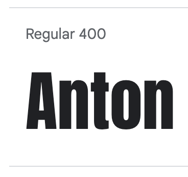

<h1 align="center">CrossFit Oxford Project</h1>

[View the live project here.](https://develosi.github.io/crossfit-oxford/)

The purpose of this project was to create a website using the skills and techniques I've learned in HTML and CSS so far. 
I decided to design and create a website for an imaginary CrossFit Gym business based in Oxford UK.

Please note this is not a real business and there is not a CrossFit gym based in Oxford as far as I am aware of.

As I am interested in the fitness industry myself this is a type of website that I thought I may encounter, as such I feel that I should have a good idea of what a potential site visitor maybe looking for. 
The website for the purpose for the project is over three pages, if it were a real CrossFit gym website I would be looking to add other features and content that a potential visitor may want to see. 

---

## User Experience (UX)

### User Visitor Goals

- I want to easily and quickly learn more about the gym, what is has to offer and what facilities are available.

- I want to be able to easily navigate throughout the site to find the information I need.

- I want to see the contact information quickly and find out the location of the gym.

- I want to find out more about the personal trainers and coaches that are based at the gym.

- I want to locate the social media links to see their following to determine how trusted and well known they are.
- I want to know how I can become a member of the gym.

- I want to know if there are any special offers available for first time members joining the gym.

--- 

## Design

### Colour Scheme

- The colour scheme is mainly dark grey, red, black and white. The red was chosen as this red is mostly associated with CrossFit gyms.

- For the background I decided to keep the theme to a dark grey rather than using a light colour to help add intensity and contrast well with the red used throughout.

- I created a colour palette for the site though some colours have not been used. If the site was to be expanded upon then I can see more use cases for the other colours in the palette. 

### Typography

- For the logo I used Anton from Google fonts.

- For body text Roboto font is used, using 400 weight for regular informational sections, 900 weight in italic is used for headings and important information. Roboto is also from Google fonts.

- Sans-serif was used as the back up font through out the website.

### Imagery 

- The background hero images at the top of each page is designed to be bold yet subliminal.

- The users attention should be focused on the callout wording in front of each hero image.

- The user may not notice the background hero image at first glance but when they notice it the image should reinforce what type of environment they should expect to find at the gym. 

### Wireframes

- Wireframes were created to keep a very clean and minimal design throughout so that the user can get to the information they require quickly and easily.

- After the wireframes were created and development of the site had commenced some small changes to the layout have been made. 

---

## Features

- The most important aspect of the site is that it is usable on all devices and especially on mobile.

- Bootstrap has been used extensively throughout the site to ensure responsiveness and usability on all screen sizes.

- There is a video section linked to the CrossFit youtube channel so that people can discover what are the particular advantages of CrossFit. 

- Footer section is kept clean and minimal with obvious links to social pages for the gym that open in seperate tabs.

 

- The navbar is using bootstrap code that ensures a nice minimal design and is fully responsive on all screen sizes. 

- Contact form using bootstrap ensuring responsiveness. Please note that the form is not linked to any database for the purpose of this project and the submit button doesn't have any functionality.

- Clean minimal design with icons from fontawesome quickly explaining what facilities are available at the gym on the homepage. 

- Simple layout of the "Team" section so people can quickly see a short bio of each trainer at the gym. With more time I would expand upon this section and maybe have the capability to book training sessions with each trainer. 

---

## Technologies Used

- [HTML5](https://en.wikipedia.org/wiki/HTML5) - Used for the content and structure for the site.

- [CSS3](https://en.wikipedia.org/wiki/Cascading_Style_Sheets) - Used for the styling of the site.

- [Bootstrap](https://getbootstrap.com/) - Responsive library resource using css and javascript components.

- [Fontawesome](https://fontawesome.com/) - library of icons hosted on a cdn.

- [GoogleFonts](https://fonts.google.com/) - library of fonts used hosted on Google cdn.

- [Balsamiq](https://balsamiq.com/) - Used to create the wireframes.

- [Gitpod](https://gitpod.io/) - Used to edit code on the site.

- [Github](https://github.com/) - Used to host, edit and hold repository of the website.

---

## Languages Used

- [HTML5](https://en.wikipedia.org/wiki/HTML5)

- [CSS3](https://en.wikipedia.org/wiki/Cascading_Style_Sheets)

- [Javascript](https://en.wikipedia.org/wiki/JavaScript) Please note the Boostrap library uses Javascript though I did not edit any javascript on this project. 

---

## Testing

### HTML and CSS Code

#### HTML
- [W3C HTML Validator](https://validator.w3.org/) No errors were found.
#### CSS
- [W3C (Jigsaw) CSS Validator](https://jigsaw.w3.org/css-validator/) No errors were found.

### Responsiveness

- Manual checks carried out on Google dev tools to ensure full responsiveness on various device screen sizes. 

- Manual checks carried out on site [responsivedesignchecker](https://responsivedesignchecker.com/) to check usability on various device screen sizes.

### Browser Testing

- Manual checks complete on browsers Firefox, Opera, Safari and Chrome to ensure all pages displayed correctly and had full responsive functionality on all screen sizes from mobile to desktop.

### Google Lighthouse

- Google lighthouse testing was carried out on the site. 

- The site got an initial low score particularly on speed performance before using compressed images. 

- All images on the site were compressed to improve the performance. 

- The Lighthouse review gave an initial performance score in desktop mode of 44, the second round gave a score of 98 after the images were compressed. 

- With more time I would have spent longer on the data recovered from the Lighthouse review to look at each score in more detail so further improvements could be made to the site. 

### Testing User Stories From User Visitor Goals

#### I want to easily and quickly learn more about the gym, what is has to offer and what facilities are available.

- On the opening home page you are greeted with a hero banner with a callout section explaining that the gym is a "Strength and Conditioning" type of facility. 

- As you scroll down the home page you are shown a short video explaining what CrossFit is.

- The last section on the homepage shows a quick breakdown of the main key points the gym has to offer in the way of facilities with icons and a short description. 

#### I want to be able to easily navigate throughout the site to find the information I need.

- The site has a very clean and minimal design with high contrasting colours. 

- The navbar along with the homepage callout section shows you other places on the site that you can find other information that you may need. 

#### I want to see the contact information quickly and find out the location of the gym. 

- The contact page immediately greets you with a contact form with a callout at the top of the page explaining what the form can be used for. 

- There is also an address section under the form for people that would like to visit in person. 

- With more time I would like to have also added a Google map showing the location of the gym exactly with interactivity.

#### I want to find out more about the personal trainers and coaches that are based at the gym.

- On the homepage you can navigate to the "Team" page where you are presented with a short bio of each of the team members. 

#### I want to locate the social media links to see their following to determine how trusted and well known they are.

- Social media links for the gym are clearly shown in the footer of each page and open in a new browser tab. 

#### I want to know how I can become a member of the gym. 

- On the homepage there is a bold callout section at the top of the page that takes you to the contact section where the form explains that it is to be used for new members to get in touch with the gym.

- The button on the homepage asks the user to "Become a member" which takes you directly to the contact form.

#### I want to know if there are any special offers available for first time members joining the gym.

- On the homepage main callout section it is shown in bold that there is a free first session available for all new members that join the gym. 

---

## Features Left to Implement

- On the Teams page a link to be able to directly book personal training sessions with each of the trainers. 

- Timetable page added that is interactive and is updated live by the staff at the gym. 

- Blog content for SEO as well as advice and guidance for current members and potential new members. 

- More detailed contact page with interactive map. 

- A callout section to sign up to email list for information and regular updates from the gym. 

- Possibly an online store section so that members can buy apparel and equipment. This could be linked to a small physical store within the gym using Shopify. 

- Add more styling and interactivity on the site to add to the user experience. 

---

## Known Bugs 

### Resolved

#### Discovered During W3 validator checks

- Fix to iframe border for the YouTube video as it was giving an error from validator, it is a known issue and was resolved with info from stackoverflow. [Source](https://stackoverflow.com/questions/3601273/html5-and-frameborder/20719286)

- Fixed using double hyphens on comments as this was causing an XML error. 

- Placing aria labels in correct position on multiple locations. 

#### Discovered Throughout Build and During Testing

- Fixed red glow on contact form from standard blue Bootstrap colour to a custom red that I wanted to use. Fix found on Stackoverflow. [Source](https://stackoverflow.com/questions/14820952/change-bootstrap-input-focus-blue-glow)

### Unresolved 

- Navbar toggler menu after expanded doesn't close with secondary click as it should. This is an issue with the javascript in Bootstrap and I have been unable to resolve. I have found a few potential fixes and workarounds online but none of them worked. 
As I learn more about Javascript I may come back to this issue to fix. 

- On smaller screen sizes the homepage callout section is not correctly positioned. Noticed on phone screens of 320 x 480. Need to go back and check on all margins and padding for hero image callout section at top of homepage. I think this is the issue.  
 
- Contact form is not linked up to anywhere and that needs to be set up with a server to complete. 

- I would like to continue investigating with Google Lighthouse to increase the site performance and look into more detail on the other metrics that it is analysing. 

--- 

## Deployment

- The site was deployed to [GitHub](https://pages.github.com/) pages. Using the following steps:

- Create a repository on GitHub and initialise it with a README.MD file.

- The root of your repository must contain an index.html file which will be the main page of your live GitHub Page.

- Go to repository settings, scroll to GitHub Pages and select the master branch for your source.

- Save the selection and when the page reloads the link to your live site will be in the GitHub Pages section. The link can take up to 1 hour to go live.

- The live link for this website can be found [here](https://develosi.github.io/crossfit-oxford/).

---

## Credits

### Media

- All images used on the site are free to use for non commercial use: [Pexels](https://www.pexels.com/)

- README file mockup of website on desktop and mobile: [techsini](https://techsini.com/multi-mockup/index.php)

- Youtube video about CrossFit made by CrossFit Organisation: [YouTube](https://www.youtube.com/watch?v=mlVrkiCoKkg)

- Icons: [Fontawesome](https://fontawesome.com/) 

- Fonts: [GoogleFonts](https://fonts.google.com/)

### Content

- All content was written by myself with inspiration from various CrossFit gym websites around the country to get ideas on the types of services that they offer.

- Inspiration on the design and layout has been taken from the previous projects that I have completed during the course such as Love Running, Whiskey Drop and the CV project. 

### Code

- Background image code for full screen used in the hero callout section of each page: [css-tricks.com](https://css-tricks.com/perfect-full-page-background-image/).

- README file template I used was from Code Institute: [Source](https://github.com/Code-Institute-Solutions/SampleREADME).

- Bootstrap code used throughout site to maintain responsiveness: [Bootstrap](https://getbootstrap.com/).

- Some code is from the Code Institute Whiskey Drop project and those sections have comments showing where that code is used.

---

## Acknowledgements

- My mentor Nishant for his guidance. 

- My teacher Philip for his advice and patience with me. : )  

- Other students in my class that have been generous enough to give tips and advice. 
